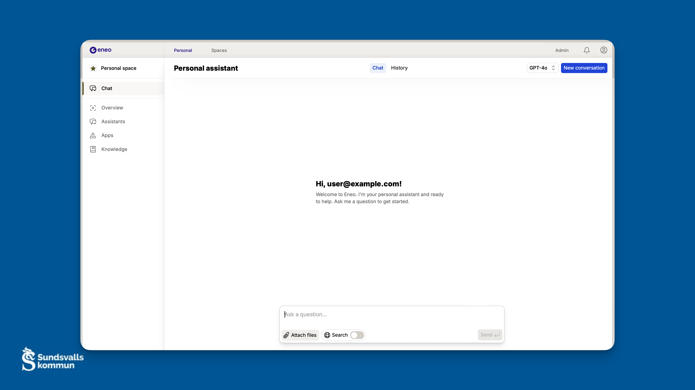
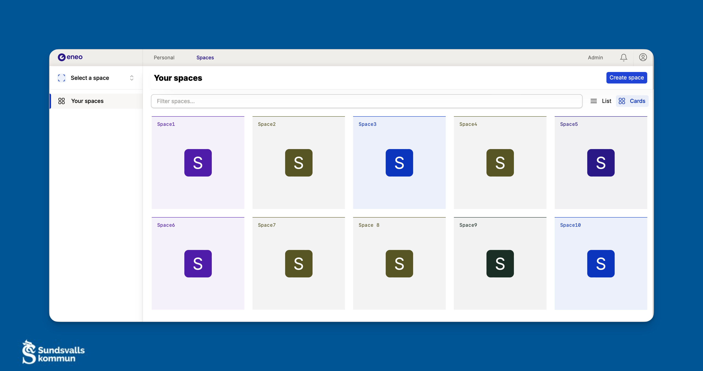
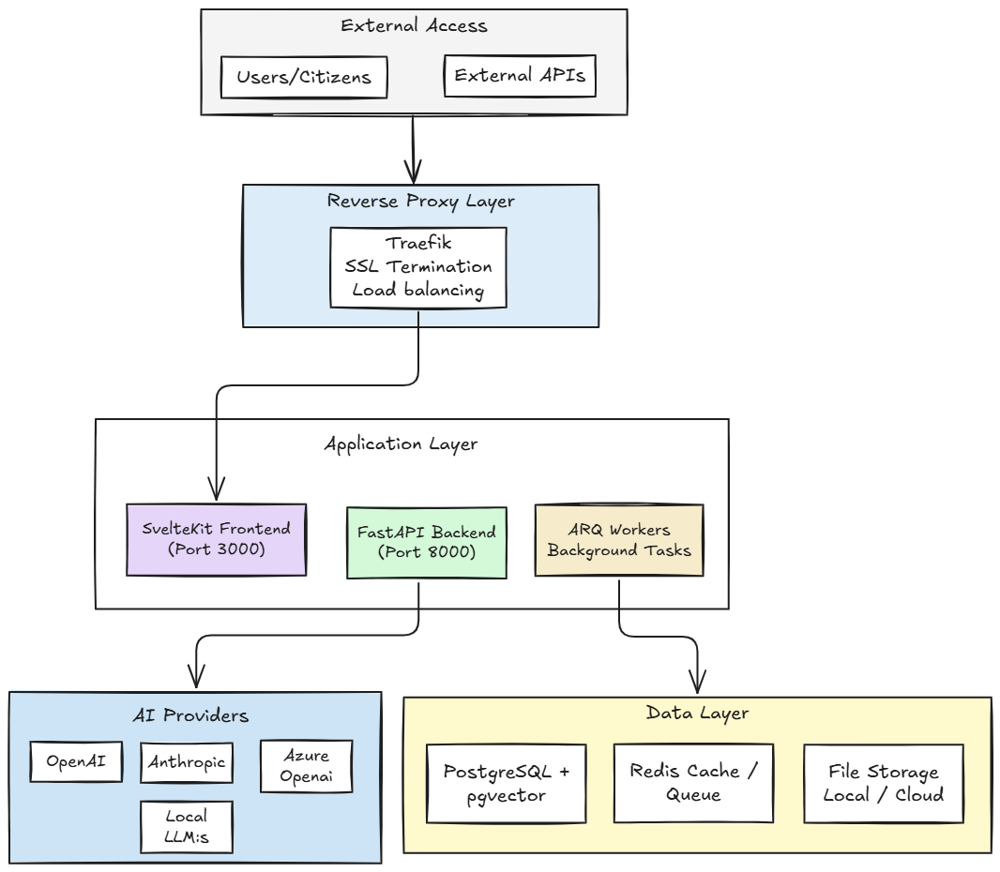

<div align="center">


# Eneo

**Democratic AI Platform for the Public Sector**

[](https://www.gnu.org/licenses/agpl-3.0)
[](https://github.com/sundsvallai/eneo)
[](#contributing)

[Quick Start](#-quick-start) • [Features](#-features) • [Documentation](#-documentation) • [Architecture](#-architecture) • [Contributing](#-contributing)

</div>

---

## 🎯 What is Eneo?

Eneo is an open-source AI platform specifically designed for Swedish public sector organizations to deploy and manage AI assistants while maintaining complete control over data, security, and algorithms. Originally developed by Sundsvall Municipality and Ånge Municipality, Eneo embodies the principle that **"Generative AI must not be a technology for the few, but a technology for everyone."**

### Why Eneo?

- **🏛️ Public Sector First**: Built specifically for municipal and government organizations
- **🔒 Data Sovereignty**: Complete control over your data and AI infrastructure
- **🌐 Model Agnostic**: Support for multiple AI providers without vendor lock-in
- **🤝 Democratic AI**: Open governance through user association
- **📋 Compliance Ready**: Built-in support for GDPR and EU AI Act
- **🔓 Fully Open Source**: AGPL v3 licensed for maximum transparency

---

## ✨ Features

### 🤖 AI Assistant Management
- Create and customize AI assistants for specific organizational needs
- Support for multiple AI providers (OpenAI, Anthropic, Azure, local models)
- System prompts and behavior customization
- Assistant-specific API access for integrations

### 👥 Collaborative Spaces
- **Shared Workspaces**: Team-based development and deployment of AI applications
- **Role-based Access**: Admin, Editor, and Viewer permissions
- **Cross-organizational Sharing**: Controlled sharing between municipalities
- **Production Management**: Dedicated workflows for citizen-facing services

### 📚 Knowledge Management
- **Document Processing**: PDF, Word, PowerPoint with intelligent chunking
- **Web Crawling**: Automated content extraction from websites
- **Vector Search**: Semantic search using PostgreSQL with pgvector
- **Real-time Processing**: Background task system for file processing

### 🔄 Real-time Capabilities
- **Streaming Chat**: Server-Sent Events for real-time AI responses
- **WebSocket Updates**: Live status updates for background tasks
- **Background Processing**: Async document processing and web crawling

### 🌍 Multi-language Support
- Swedish and English interface with type-safe translations
- URL localization with clean language prefixes
- Live language switching without page reload

---

## 🚀 Quick Start

### Prerequisites
- Docker and Docker Compose
- At least one AI provider API key (OpenAI, Anthropic, etc.)

### 1. Download Deployment Files

```bash
# Create directory and download only what you need
mkdir eneo-deployment && cd eneo-deployment

# Download pre-configured deployment files
curl -o docker-compose.yml https://raw.githubusercontent.com/sundsvallai/eneo/main/deployment/docker-compose.yml
curl -o env_backend.template https://raw.githubusercontent.com/sundsvallai/eneo/main/deployment/env_backend.template
curl -o env_frontend.template https://raw.githubusercontent.com/sundsvallai/eneo/main/deployment/env_frontend.template
curl -o env_db.template https://raw.githubusercontent.com/sundsvallai/eneo/main/deployment/env_db.template
```

### 2. Configure Environment

```bash
# Copy environment templates
cp env_backend.template env_backend.env
cp env_frontend.template env_frontend.env
cp env_db.template env_db.env

# Edit environment files with your configuration
# REQUIRED: Add at least one AI provider API key
# REQUIRED: Set secure JWT_SECRET (generate with: openssl rand -hex 32)
```

### 3. Deploy

```bash
# Start services with pre-built images
docker network create proxy_tier
docker compose up -d
```

### 4. Access Eneo

- **Platform**: https://your-domain.com
- **API Documentation**: https://your-domain.com/docs
- **Default Login**: `user@example.com` / `Password1!`

> 🔐 **Important**: Change the default password immediately after first login!

### 🖼️ Platform Overview

<div align="center">

<p><em>Personal AI Assistant with customizable models and real-time chat interface</em></p>
</div>

<div align="center">

<p><em>Collaborative spaces for team-based AI development and deployment</em></p>
</div>

---

## 🏗️ Architecture

Eneo follows a modern microservices architecture with clean separation of concerns:

<details>
<summary>🔍 Click to view architecture diagram</summary>

```

</details>

### Technology Stack

- **Frontend**: SvelteKit with TypeScript, Tailwind CSS
- **Backend**: FastAPI (Python 3.11+) with SQLAlchemy
- **Database**: PostgreSQL 16 with pgvector extension
- **Cache/Queue**: Redis with ARQ task processing
- **Deployment**: Docker Compose with Traefik reverse proxy
- **AI Integration**: Multi-provider support (OpenAI, Anthropic, Azure, etc.)

---

## 📚 Documentation

| Document | Purpose |
|----------|---------|
| **[Installation Guide](docs/INSTALLATION.md)** | Development environment setup |
| **[Deployment Guide](docs/DEPLOYMENT.md)** | Production deployment |
| **[Architecture Guide](docs/ARCHITECTURE.md)** | Technical architecture overview |
| **[Contributing Guide](docs/CONTRIBUTING.md)** | Development workflow |
| **[Troubleshooting](docs/TROUBLESHOOTING.md)** | Common issues and solutions |
| **[Security Guide](docs/SECURITY.md)** | Security practices |

### API Documentation
- **Development**: http://localhost:8123/docs
- **Production**: https://your-domain.com/docs
- **OpenAPI Schema**: Auto-generated from FastAPI
- **Type Safety**: Full TypeScript types for frontend integration

---

## 🤝 Contributing

Eneo is developed by the Swedish public sector for the global community. Contributions are welcome from municipalities, organizations, and individuals who share our vision of democratic AI.

### Quick Contribution Guide

1. **Fork** the repository
2. **Create** a feature branch
3. **Follow** coding standards (see [Contributing Guide](CONTRIBUTING.md))
4. **Write tests** for new functionality
5. **Submit** a pull request

### Development Standards
- **Python**: PEP 8, type hints, comprehensive testing
- **TypeScript**: ESLint configuration, strict type checking
- **Architecture**: Domain-driven design patterns
- **Testing**: Unit and integration test coverage

For detailed guidelines, see our [Contributing Guide](docs/CONTRIBUTING.md).

---

## 🌍 Community & Governance

### Democratic Control
Eneo is governed by a user association of public sector organizations, ensuring that development priorities align with public interest rather than commercial goals.

### User Association
- **Digital Collaboration**: Join our collaboration space for municipalities
- **Knowledge Sharing**: Share experiences and best practices
- **Collective Development**: Influence platform direction through democratic participation

**Contact**: `digitalisering@sundsvall.se` for collaboration space access (public sector organizations only)

### Open Source Commitment
- **License**: AGPL v3 ensures all improvements remain open
- **No Vendor Lock-in**: Use any AI provider or deployment method
- **Community Driven**: Decisions made collectively by user association

---

## 📈 Use Cases

### Municipal Applications
- **Citizen Services**: AI assistants for municipal websites
- **Internal Operations**: Administrative support and automation
- **Cross-municipal Collaboration**: Share AI applications between municipalities
- **Compliance Management**: Built-in GDPR and AI Act compliance tools

### Enterprise Applications
- **Knowledge Management**: Organizational knowledge bases with AI search
- **Customer Support**: AI-powered assistance with internal data
- **Document Processing**: Automated analysis and summarization
- **Integration Platform**: Connect with existing enterprise systems

---

## 🔒 Security & Compliance

- **Data Protection**: GDPR-compliant by design
- **EU AI Act Ready**: Built-in compliance features
- **Audit Trails**: Comprehensive logging and tracking
- **Security Classifications**: Data sensitivity handling
- **Access Control**: Role-based permissions and multi-tenancy

---

## 🙏 Acknowledgments

Eneo builds on the success of [Open ePlatform](https://www.openeplatform.org/), another Swedish municipal open-source project used by 200+ municipalities since 2010.

**Original Development**: Sundsvall Municipality & Ånge Municipality, Sweden 🇸🇪

**Inspiration**: Learning from Open ePlatform's success in creating sustainable municipal collaboration

**Acknowledgment**: InooLabs AB for their foundational contributions to Intric (now Eneo)

---

## 📜 License

```
Eneo - Democratic AI Platform for the Public Sector
Copyright (C) 2023-2025 Sundsvall Municipality & Ånge Municipality

This program is free software: you can redistribute it and/or modify
it under the terms of the GNU Affero General Public License as published
by the Free Software Foundation, either version 3 of the License, or
(at your option) any later version.

This program is distributed in the hope that it will be useful,
but WITHOUT ANY WARRANTY; without even the implied warranty of
MERCHANTABILITY or FITNESS FOR A PARTICULAR PURPOSE. See the
GNU Affero General Public License for more details.
```

See [LICENSE](LICENSE) for the complete AGPL v3 license text.

---

<div align="center">

**Made with ❤️ by the Swedish Public Sector for the Global Community**

*Empowering democratic access to AI technology*

[🌐 Project Website](#) • [📧 Contact](mailto:digitalisering@sundsvall.se) • [💬 Discussions](https://github.com/sundsvallai/eneo/discussions)

</div>
