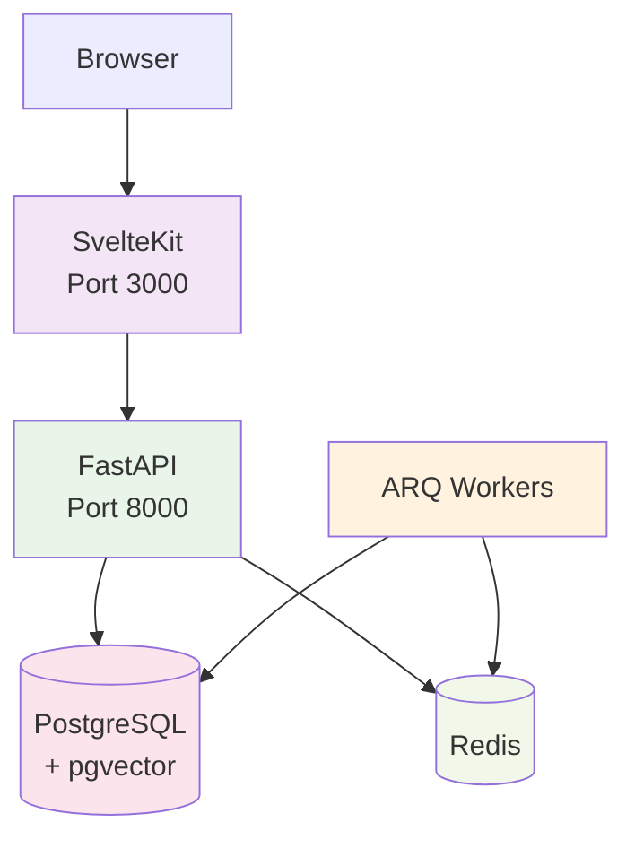

# Intric Community - Comprehensive Documentation

<div align="center">


**An open-source AI-powered knowledge management platform**

[](https://opensource.org/licenses/Apache-2.0)
[](https://github.com/intric-ai/intric-community)
[](old-docs-to-update/contributing.md)

[Features](#features) • [Quick Start](#quick-start) • [Documentation](#documentation) • [Architecture](#architecture) • [Development](#development) • [Deployment](#deployment) • [Contributing](#contributing)

</div>

## 🌟 Overview

Intric is an open-source AI platform that empowers organizations to create, deploy, and manage AI-powered knowledge systems while maintaining full control over security, data, and algorithms. Originally developed by Sundsvall municipality in Sweden, Intric provides equitable access to generative AI capabilities for public and private organizations.

### Why Intric?

- **Technology Independence**: Use any AI service or language model that fits your security requirements
- **Control & Compliance**: Full control over security, data, and algorithms to meet regulatory requirements
- **Knowledge Integration**: Utilize your organization's internal data as a knowledge base for AI assistants
- **Open Collaboration**: Share AI applications and experiences through open source
- **Production Ready**: Battle-tested in enterprise environments with HAProxy and RHEL8

## ✨ Features

### 🤖 AI Assistants
- Create chatbot-based AI assistants tailored to specific needs
- Customizable system prompts and behavior settings
- Multi-LLM support (OpenAI, Anthropic, Azure, OVHCloud, Mistral, VLLM)
- Assistant-specific API keys for programmatic access

### 📚 Knowledge Management
- **Document Processing**: PDF, Word, PowerPoint, text files with automatic chunking
- **Web Crawling**: Automated website content extraction with configurable limits
- **Vector Search**: Semantic search using PostgreSQL with pgvector
- **Real-time Processing**: Background tasks with ARQ queue system

### 👥 Team Collaboration
- **Workspaces (Spaces)**: Isolated environments for teams with role-based access
- **Multi-tenancy**: Owner, Admin, Editor, Viewer roles
- **Shared Resources**: Assistants, knowledge bases, and conversations
- **User Management**: Local authentication or OIDC integration

### 🔄 Real-time Features
- **Streaming Chat**: Server-Sent Events (SSE) for real-time response streaming
- **WebSocket Updates**: Live status updates for background tasks via Redis pub/sub
- **Background Processing**: Async document processing and web crawling

### 🌍 Internationalization
- **Multi-language Support**: Swedish (sv) and English (en) with type-safe translations
- **Powered by Paraglide-JS**: Type-safe i18n with automatic fallbacks
- **URL Localization**: Clean URLs with language prefixes (`/` for Swedish, `/en/` for English)
- **Live Language Switching**: Switch languages without page reload

### 🔗 Integrations
- **Multiple LLM Providers**: OpenAI, Anthropic, Azure OpenAI, OVHCloud, Mistral, VLLM
- **Authentication**: Local auth with JWT, MobilityGuard OIDC, Zitadel support
- **Storage**: Local filesystem or cloud storage options
- **Vector Database**: PostgreSQL with pgvector extension for semantic search

<div align="center">

<p><i>The Intric platform interface showing various AI assistants</i></p>
</div>

## 🚀 Quick Start

Choose your setup based on your use case:

### 💻 Development Setup

#### Option 1: Devcontainer (Fastest - Recommended)

Perfect for development with all dependencies pre-configured:

1. **Prerequisites**: Docker and VS Code with Dev Containers extension
2. **Clone and Open**:
   ```bash
   git clone https://github.com/intric-ai/intric-community.git
   cd intric-community
   code .  # VS Code will prompt to "Reopen in Container"
   ```
3. **Start Services** (the devcontainer shows instructions):
   ```bash
   # Terminal 1: Backend
   cd backend && poetry run python init_db.py && poetry run start
   
   # Terminal 2: Frontend  
   cd frontend && pnpm run dev
   
   # Terminal 3: Worker (optional)
   cd backend && poetry run arq src.intric.worker.arq.WorkerSettings
   ```

#### Option 2: Local Development Setup

**Prerequisites:**
- **Python 3.11+**
- **Node.js 18+**
- **pnpm 9.12.3**
- **Docker & Docker Compose**
- **System libraries**: `libmagic1` and `ffmpeg`

```bash
# Install required system libraries (Ubuntu/Debian)
sudo apt-get install libmagic1 ffmpeg
```

**Setup Steps:**

<details>
<summary>Click to view detailed setup commands</summary>

```bash
# 1. Clone the repository
git clone https://github.com/intric-ai/intric-community.git
cd intric-community

# 2. Set up environment files
cp backend/.env.template backend/.env
cp frontend/apps/web/.env.example frontend/apps/web/.env

# 3. Edit environment files (add your LLM API keys)
# Backend: Set JWT_SECRET, POSTGRES_PASSWORD, API keys
# Frontend: Set JWT_SECRET (must match backend), INTRIC_BACKEND_URL

# 4. Start infrastructure services (PostgreSQL with pgvector and Redis)
cd backend
docker compose up -d

# 5. Install and setup backend
poetry install
poetry run python init_db.py  # Creates database schema and default user

# 6. Start the backend API server (Terminal 1)
poetry run start  # Runs on port 8000

# 7. Start background worker (Terminal 2 - Optional but recommended)
poetry run arq src.intric.worker.arq.WorkerSettings

# 8. Install and setup frontend (Terminal 3)
cd ../frontend
pnpm install
pnpm run setup
pnpm -w run dev  # Runs on port 3000
```

</details>

### CI/CD Pipeline

The project includes a GitHub Actions workflow for automated builds:

- **Location**: `.github/workflows/build_and_push_images.yml`
- **Triggers**: Push to main branch, pull requests
- **Actions**: Build and push Docker images, run tests
- **Registry**: Configurable Docker registry for image storage

### 🚀 Production Deployment

For production deployment on servers:

```bash
# Quick production setup (10 minutes)
sudo dnf install podman podman-compose  # or docker docker-compose
sudo mkdir -p /opt/intric-production && cd /opt/intric-production

# Create environment files (see deployment guide for details):
# - .env (container images and ports)
# - env_backend (API keys, security)  
# - env_db (database config)
# - env_frontend (URLs)

sudo chmod 600 env_* && sudo chown -R 999:999 data/
podman-compose up -d
```

**📖 [Complete Production Deployment Guide](docs/deployment-guide.md)** covers:
- Container orchestration (Podman/Docker)
- Systemd integration for auto-start
- HAProxy/Nginx reverse proxy setup
- Environment configuration
- Security best practices
- RHEL8/Enterprise deployment

### Access the Application

- **Frontend**: http://localhost:3000
- **Backend API**: http://localhost:8000
- **API Documentation**: http://localhost:8000/docs
- **Default Login**: `user@example.com` / `Password1!`

### Troubleshooting Quick Start

- **Database Connection Issues**: Verify PostgreSQL is running: `docker compose ps db`
- **Frontend Not Loading**: Check `INTRIC_BACKEND_URL=http://localhost:8000` in frontend `.env`
- **Port Conflicts**: Check if ports 8000, 3000, 5432, 6379 are available
- **Authentication Issues**: Ensure `JWT_SECRET` matches between backend and frontend
- **Production Issues**: See the [Deployment Guide](docs/deployment-guide.md) troubleshooting section

## ⚙️ Configuration

**Environment Setup:**
- **Backend**: Copy `backend/.env.template` to `backend/.env` and add your AI API keys
- **Frontend**: Copy `frontend/apps/web/.env.example` to `frontend/apps/web/.env` and match JWT_SECRET

**Essential Variables:**
- `JWT_SECRET`: Must be identical in both backend and frontend
- `OPENAI_API_KEY` / `ANTHROPIC_API_KEY` / `AZURE_API_KEY`: At least one AI provider required
- `POSTGRES_*` and `REDIS_*`: Database connections (defaults work for development)

📖 **Complete Configuration Reference**: [Development Guide](docs/development-guide.md#environment-configuration)

## 🏗️ Architecture

**Modern Stack**: SvelteKit frontend + FastAPI backend + PostgreSQL with pgvector + Redis
**Key Patterns**: Domain-driven design, multi-tenancy, real-time processing, API-first
**Deployment**: Container-based with optional HAProxy load balancing



📖 **Detailed Architecture**: [Architecture Guide](docs/architecture.md) | [Domain-Driven Design](docs/domain-driven-design.md)

## 💻 Development

**Tech Stack**: Python 3.11+ (FastAPI) + Node.js 18+ (SvelteKit) + PostgreSQL + Redis
**Architecture**: Domain-driven design with clean separation of concerns
**Tools**: Poetry, pnpm, Docker, pytest, TypeScript, Vite

📖 **Complete Development Guide**: [Development Guide](docs/development-guide.md)
📖 **Contribution Guidelines**: [Contributing Guide](docs/contributing.md)

## 🚀 Production Deployment

**Container-based**: Podman/Docker with compose orchestration + optional HAProxy
**Enterprise-ready**: RHEL8, SELinux, systemd, SSL termination, load balancing
**Scalable**: Multi-instance backends, shared database, Redis clustering

📖 **Complete Deployment Guide**: [Deployment Guide](docs/deployment-guide.md)

## 📚 Documentation

| Guide | Purpose |
|-------|---------|
| [Development Guide](docs/development-guide.md) | Local setup, architecture, testing |
| [Deployment Guide](docs/deployment-guide.md) | Production deployment, SSL, containers |
| [Architecture Guide](docs/architecture.md) | System design and patterns |
| [Contributing Guide](docs/contributing.md) | Development workflow and standards |
| [Troubleshooting Guide](docs/troubleshooting.md) | Common issues and solutions |

**API Docs**: Available at `/docs` endpoint during development

## 🤝 Contributing

**Welcome Contributors!** Fork → Feature Branch → Tests → PR → Review

**Standards**: PEP 8 (Python), ESLint (TypeScript), Domain-driven design, ≥80% test coverage

📖 **Detailed Guidelines**: [Contributing Guide](docs/contributing.md)

## 🔧 Support

**Get Help**: GitHub Issues • Documentation Guides • Community Discussion

**Quick Fixes**: Check JWT_SECRET matches, verify API keys, ensure database is running

📖 **Detailed Troubleshooting**: [Troubleshooting Guide](docs/troubleshooting.md)

## 👥 Community

**Origin**: Developed by Sundsvall municipality, Sweden 🇸🇪
**License**: Apache 2.0 for maximum flexibility
**Users**: Public sector, enterprises, research institutions, SMBs worldwide

## 📜 License

Apache License 2.0 - Free for commercial and non-commercial use

---

**Made with ❤️ by the Intric Community**

*Empowering organizations with open-source AI knowledge management*