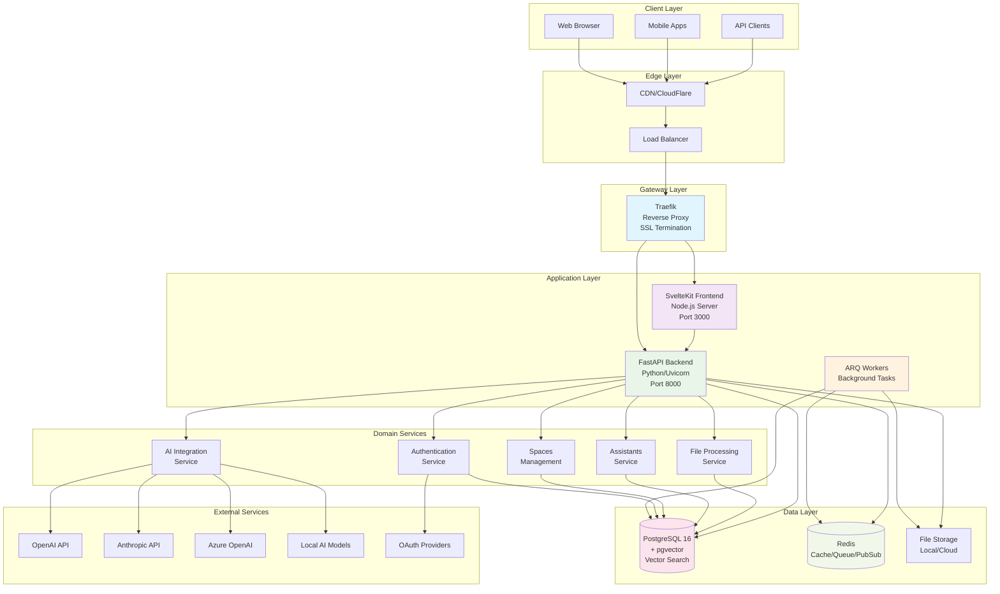
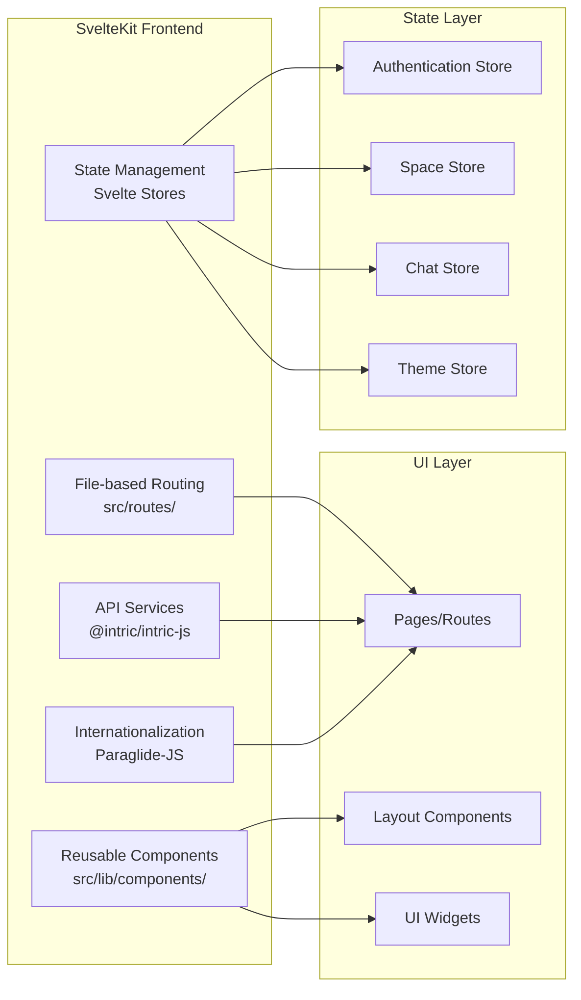
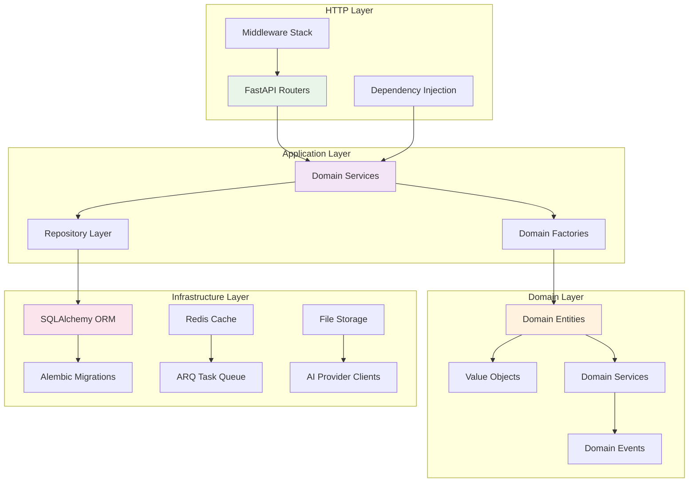
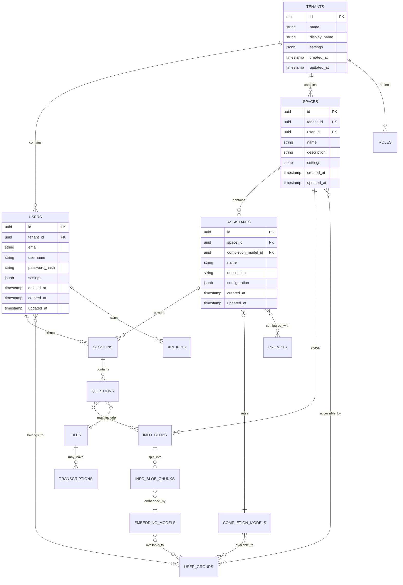
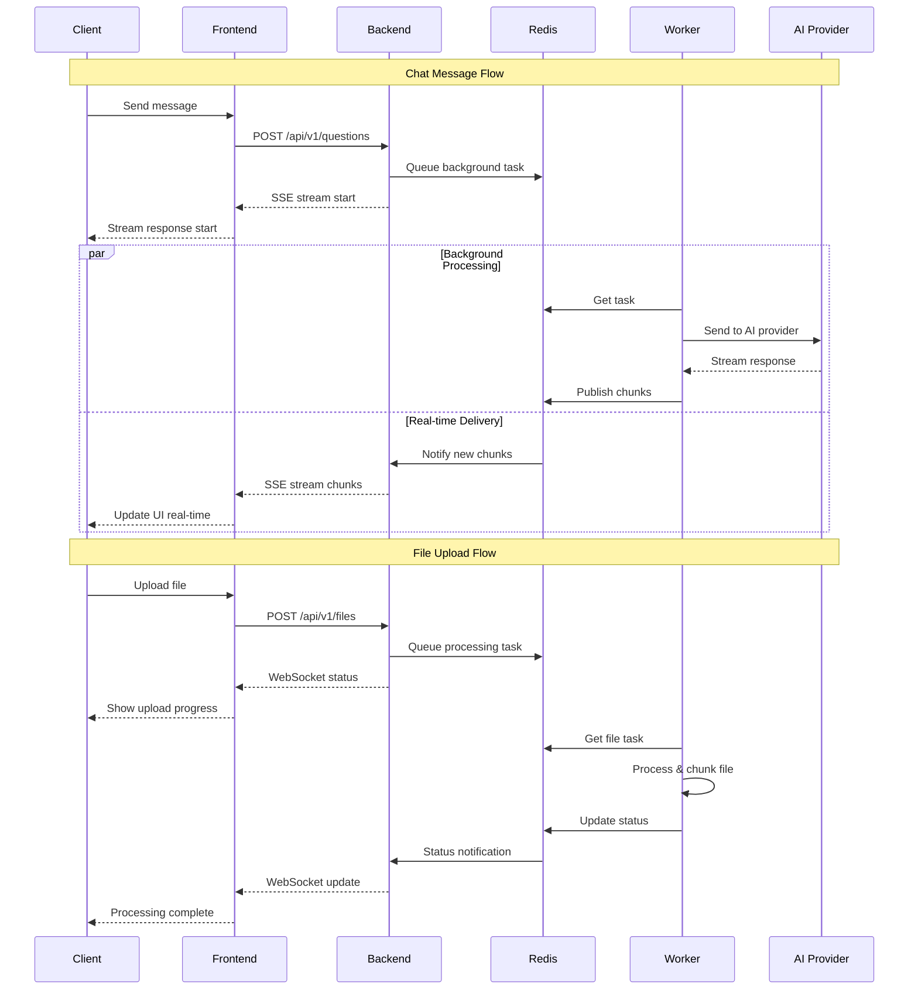
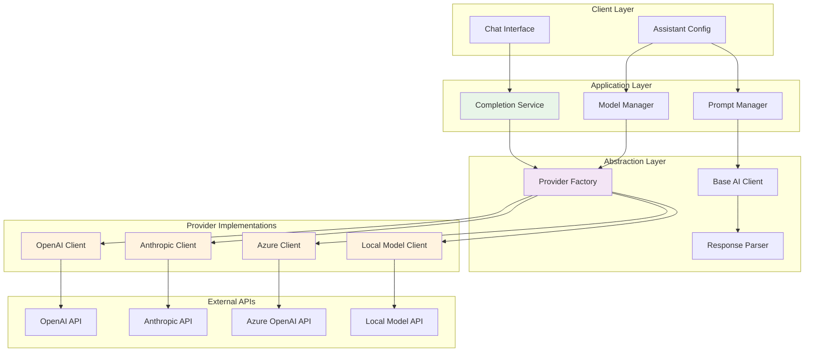
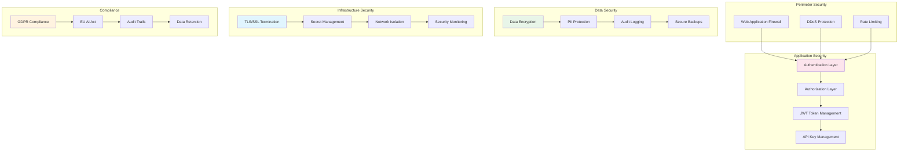
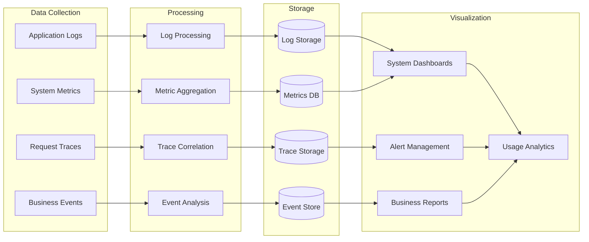
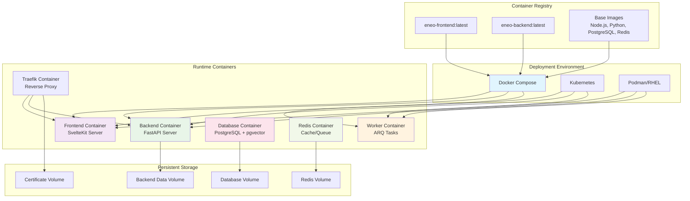

# Architecture Guide

This guide provides a comprehensive overview of Eneo's technical architecture, design patterns, and system components.

---

## 🏗️ System Overview

Eneo follows a **microservices architecture** with **domain-driven design** principles, built for scalability, maintainability, and democratic AI governance.

### Core Principles

- **🏛️ Domain-Driven Design**: Business logic organized by domain boundaries
- **🔄 Event-Driven Architecture**: Asynchronous processing via Redis pub/sub
- **🔌 API-First Design**: OpenAPI specification with auto-generated documentation
- **🎯 Multi-Tenancy**: Secure isolation between organizations
- **🚀 Real-Time Communication**: WebSockets and Server-Sent Events
- **🔒 Security by Design**: Built-in compliance and access control

---

## 🗄️ High-Level Architecture

<details>
<summary>🔍 Click to view complete system architecture</summary>



</details>

---

## 🏢 Domain-Driven Design Structure

Eneo implements DDD patterns with clear domain boundaries and consistent architectural patterns.

### Domain Organization

```
backend/src/intric/
├── assistants/           # AI Assistant Management Domain
├── spaces/              # Collaborative Workspaces Domain
├── users/               # User Management Domain
├── completion_models/   # AI Model Integration Domain
├── embedding_models/    # Vector Search Domain
├── files/               # Document Processing Domain
├── sessions/            # Conversation Management Domain
├── authentication/     # Security and Access Control Domain
├── groups_legacy/       # User Groups Domain (Legacy)
├── tenants/            # Multi-tenancy Domain
└── workflows/          # Business Process Automation Domain
```

### Domain Pattern Structure

Each domain follows a consistent layered architecture:

<details>
<summary>📁 Click to view domain structure pattern</summary>

```
domain_name/
├── api/                           # Presentation Layer
│   ├── domain_models.py          # Pydantic schemas for API
│   ├── domain_router.py          # FastAPI route definitions
│   └── domain_assembler.py       # Domain-to-API transformation
├── application/                   # Application Layer
│   └── domain_service.py         # Business logic and use cases
├── domain/                        # Domain Layer
│   ├── domain.py                 # Domain entities and value objects
│   └── domain_repo.py            # Repository interfaces
├── infrastructure/               # Infrastructure Layer
│   └── domain_repo_impl.py       # Repository implementations
├── domain_factory.py             # Domain object creation
└── __init__.py
```

**Layer Responsibilities:**
- **API Layer**: HTTP request/response handling, data validation
- **Application Layer**: Business use cases, orchestration
- **Domain Layer**: Core business logic, entities, rules
- **Infrastructure Layer**: Database access, external services

</details>

---

## 🖥️ Frontend Architecture

### SvelteKit Application Structure



### Key Frontend Technologies

- **Framework**: SvelteKit with TypeScript
- **Package Manager**: pnpm with workspace support
- **UI Components**: Custom component library (@intric/ui)
- **Styling**: Tailwind CSS v4
- **API Client**: Type-safe client (@intric/intric-js)
- **State Management**: Svelte stores with reactive updates
- **Internationalization**: Paraglide-JS for Swedish/English
- **Build Tool**: Vite for development and production builds

---

## ⚙️ Backend Architecture

### FastAPI Application Structure

<details>
<summary>🔍 Click to view backend architecture diagram</summary>



</details>

### Core Backend Components

**Framework Stack:**
- **FastAPI**: Modern async web framework
- **SQLAlchemy**: ORM with async support
- **Alembic**: Database migration management
- **Pydantic**: Data validation and serialization
- **ARQ**: Async Redis Queue for background tasks

**Architecture Patterns:**
- **Repository Pattern**: Data access abstraction
- **Factory Pattern**: Complex object creation
- **Dependency Injection**: Service composition
- **Event Sourcing**: Domain event handling
- **CQRS**: Command Query Responsibility Segregation

---

## 💾 Data Architecture

### Database Design

<details>
<summary>🗄️ Click to view database schema overview</summary>



</details>

### Key Data Patterns

**Multi-tenancy:**
- All entities include `tenant_id` for data isolation
- Row-level security ensures tenant separation
- UUID primary keys prevent enumeration attacks

**Soft Deletes:**
- Users support soft deletion with `deleted_at` timestamp
- Maintains referential integrity while hiding deleted records

**Audit Trails:**
- All entities include `created_at` and `updated_at` timestamps
- Database triggers maintain accurate timestamps
- Comprehensive logging for compliance requirements

**Vector Storage:**
- PostgreSQL with pgvector extension for semantic search
- Embeddings stored alongside metadata in `info_blob_chunks`
- Efficient similarity search with indexing strategies

---

## 🔄 Real-Time Communication

### Communication Patterns

<details>
<summary>🔍 Click to view real-time architecture</summary>



</details>

### Real-Time Technologies

**Server-Sent Events (SSE):**
- Real-time AI response streaming
- Unidirectional server-to-client communication
- Automatic reconnection and error handling
- Browser-native support with EventSource API

**WebSockets:**
- Bidirectional real-time communication
- Background task status updates
- File upload progress tracking
- System-wide notifications

**Redis Pub/Sub:**
- Message broker for real-time events
- Scalable across multiple backend instances
- Event distribution to connected clients
- Persistent connection management

---

## 🔌 AI Integration Architecture

### AI Provider Abstraction

<details>
<summary>🤖 Click to view AI integration architecture</summary>



</details>

### AI Integration Features

**Multi-Provider Support:**
- Unified interface for all AI providers
- Runtime provider switching
- Provider-specific optimizations
- Fallback and retry mechanisms

**Model Management:**
- Database-driven model configuration
- Dynamic model loading
- Cost and performance tracking
- Usage analytics and monitoring

**Context Management:**
- Conversation history handling
- System prompt management
- Context window optimization
- Memory management strategies

---

## 🏭 Background Processing

### ARQ Task System

```mermaid
graph LR
    subgraph "Task Producers"
        API[API Endpoints]
        SCHEDULER[Scheduled Tasks]
        WEBHOOK[Webhooks]
    end
    
    subgraph "Queue System"
        REDIS_QUEUE[(Redis Queue)]
        TASK_ROUTER[Task Router]
        PRIORITY[Priority Queues]
    end
    
    subgraph "Workers"
        WORKER1[Worker 1<br/>File Processing]
        WORKER2[Worker 2<br/>AI Tasks]
        WORKER3[Worker 3<br/>Web Crawling]
        WORKER_N[Worker N<br/>General Tasks]
    end
    
    subgraph "Task Types"
        FILE_TASKS[File Processing<br/>• Document parsing<br/>• Image processing<br/>• Audio transcription]
        AI_TASKS[AI Processing<br/>• Embeddings generation<br/>• Content analysis<br/>• Batch completions]
        CRAWL_TASKS[Web Crawling<br/>• Website crawling<br/>• Content extraction<br/>• Sitemap processing]
        MAINTENANCE[Maintenance<br/>• Data cleanup<br/>• Cache warming<br/>• Analytics]
    end
    
    API --> REDIS_QUEUE
    SCHEDULER --> REDIS_QUEUE
    WEBHOOK --> REDIS_QUEUE
    
    REDIS_QUEUE --> TASK_ROUTER
    TASK_ROUTER --> PRIORITY
    
    PRIORITY --> WORKER1
    PRIORITY --> WORKER2
    PRIORITY --> WORKER3
    PRIORITY --> WORKER_N
    
    WORKER1 --> FILE_TASKS
    WORKER2 --> AI_TASKS
    WORKER3 --> CRAWL_TASKS
    WORKER_N --> MAINTENANCE
```

<details>
<summary>⚙️ Click to view background task architecture</summary>



</details>

### Task Categories

**File Processing Tasks:**
- Document parsing and chunking
- Image processing and analysis
- Audio transcription
- Vector embedding generation

**AI Processing Tasks:**
- Batch AI completions
- Content summarization
- Semantic analysis
- Model fine-tuning preparation

**Web Crawling Tasks:**
- Website content extraction
- Sitemap processing
- Link discovery and validation
- Content updates and monitoring

**System Maintenance:**
- Database cleanup and optimization
- Cache warming and invalidation
- Analytics data processing
- Security audits and checks

---

## 🔒 Security Architecture

### Multi-Layer Security

<details>
<summary>🛡️ Click to view security architecture</summary>



</details>

### Security Features

**Authentication & Authorization:**
- JWT-based authentication with secure token management
- Role-based access control (RBAC) with granular permissions
- API key authentication for service integration
- Multi-factor authentication support

**Data Protection:**
- AES-256 encryption for sensitive data at rest
- TLS 1.3 for data in transit
- PII detection and masking
- Secure password hashing with bcrypt

**Compliance:**
- GDPR compliance with data subject rights
- EU AI Act readiness with transparency features
- Comprehensive audit logging
- Data retention policy enforcement

---

## 📊 Monitoring and Observability

### Observability Stack



### Monitoring Capabilities

**System Monitoring:**
- Application performance metrics
- Resource utilization tracking
- Database query performance
- Background task monitoring

**Business Monitoring:**
- User engagement analytics
- AI usage patterns
- Cost optimization metrics
- Feature adoption tracking

**Security Monitoring:**
- Authentication attempt tracking
- Authorization failure alerts
- Suspicious activity detection
- Compliance violation monitoring

---

## 🚀 Deployment Architecture

### Container Architecture

<details>
<summary>📦 Click to view container deployment architecture</summary>



</details>

### Deployment Strategies

**Development:**
- Docker Compose for local development
- DevContainer for consistent development environment
- Hot reloading for rapid iteration
- Simplified networking and storage

**Production:**
- Multi-stage Docker builds for optimization
- Traefik for SSL termination and load balancing
- Persistent volumes for data storage
- Health checks and restart policies

**Enterprise:**
- Kubernetes orchestration for high availability
- Podman for RHEL/enterprise environments
- SystemD integration for service management
- Advanced monitoring and logging

---

## 📈 Scalability Considerations

### Horizontal Scaling

**Stateless Services:**
- Frontend and backend services designed as stateless
- Load balancing across multiple instances
- Session data stored in Redis for sharing
- Database connection pooling

**Background Processing:**
- ARQ workers can be scaled independently
- Queue-based task distribution
- Priority-based task processing
- Worker specialization by task type

**Database Scaling:**
- Read replicas for query scaling
- Connection pooling and optimization
- Vector index optimization for pgvector
- Partitioning strategies for large datasets

### Performance Optimization

**Caching Strategy:**
- Redis for session and application caching
- HTTP caching with appropriate headers
- Database query result caching
- Static asset caching via CDN

**AI Provider Optimization:**
- Request batching and queuing
- Response caching for similar queries
- Provider failover and retry logic
- Cost optimization through model selection

---

## 🔧 Development Patterns

### Code Organization

**Backend Patterns:**
```python
# Domain entity example
@dataclass
class Assistant:
    id: UUID
    space_id: UUID
    name: str
    description: str
    system_prompt: str
    completion_model_id: UUID
    
    def update_configuration(self, config: AssistantConfig) -> None:
        # Domain logic here
        pass

# Repository pattern
class AssistantRepository(Protocol):
    async def find_by_id(self, id: UUID) -> Optional[Assistant]:
        ...
    async def save(self, assistant: Assistant) -> None:
        ...

# Service layer
class AssistantService:
    def __init__(self, repo: AssistantRepository):
        self._repo = repo
    
    async def create_assistant(self, request: CreateAssistantRequest) -> Assistant:
        # Business logic here
        pass
```

**Frontend Patterns:**
```typescript
// Svelte store pattern
export const assistantStore = writable<Assistant[]>([]);

// Service pattern
class AssistantService {
    async createAssistant(data: CreateAssistantRequest): Promise<Assistant> {
        return await apiClient.post('/assistants', data);
    }
}

// Component composition
<script lang="ts">
    import { assistantStore } from '$lib/stores/assistant';
    import AssistantCard from '$lib/components/AssistantCard.svelte';
</script>

{#each $assistantStore as assistant}
    <AssistantCard {assistant} />
{/each}
```

---

## 📚 Architecture Decision Records

### Key Architectural Decisions

**1. Domain-Driven Design Adoption**
- **Decision**: Organize code by business domains rather than technical layers
- **Rationale**: Better maintainability and team ownership
- **Trade-offs**: Increased complexity for simple features

**2. Multi-Provider AI Integration**
- **Decision**: Abstract AI providers behind unified interface
- **Rationale**: Vendor independence and flexibility
- **Trade-offs**: Additional complexity in provider-specific optimizations

**3. Real-Time Communication Strategy**
- **Decision**: Use SSE for streaming, WebSockets for bidirectional communication
- **Rationale**: Browser compatibility and simplicity
- **Trade-offs**: Separate connection management required

**4. Container-First Deployment**
- **Decision**: Docker/Podman as primary deployment method
- **Rationale**: Consistency across environments and simplified operations
- **Trade-offs**: Container orchestration complexity

---

This architecture supports Eneo's mission of democratic AI by providing a scalable, maintainable, and transparent platform that can grow with the needs of public sector organizations while maintaining the highest standards of security and compliance.